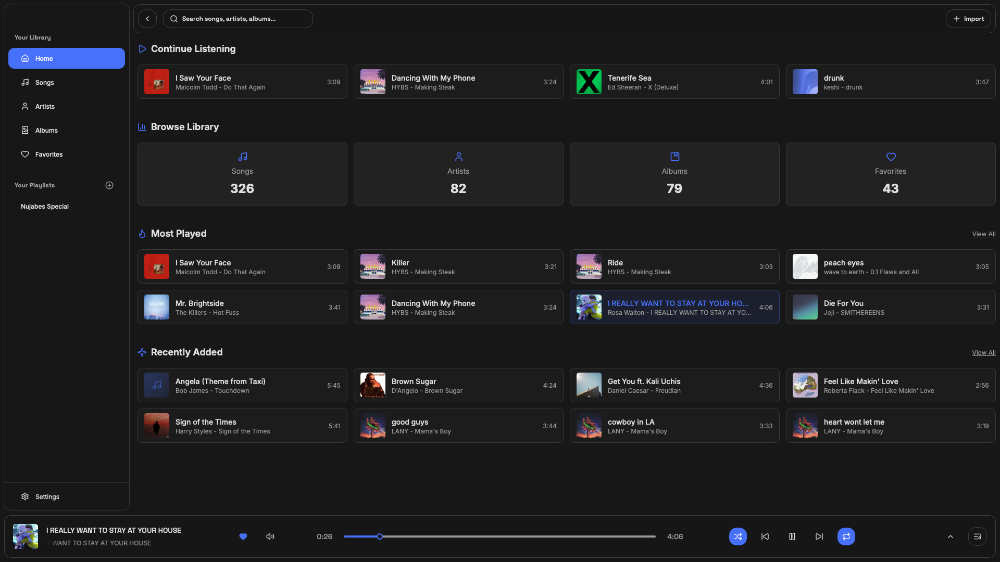
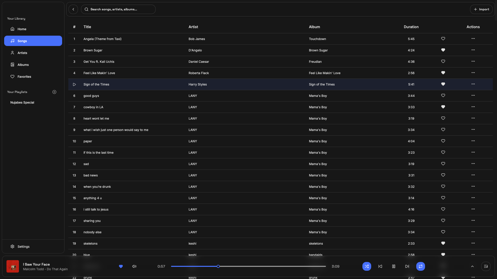
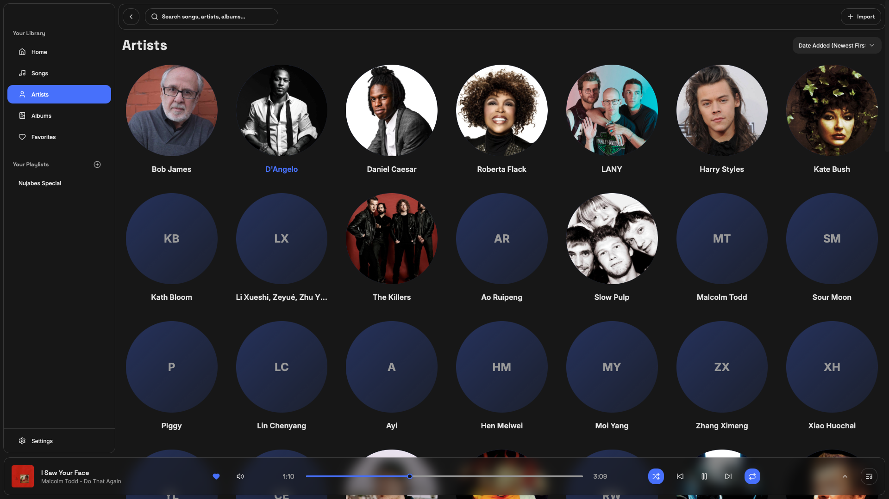
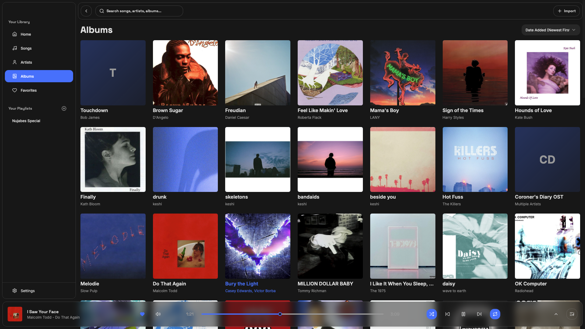
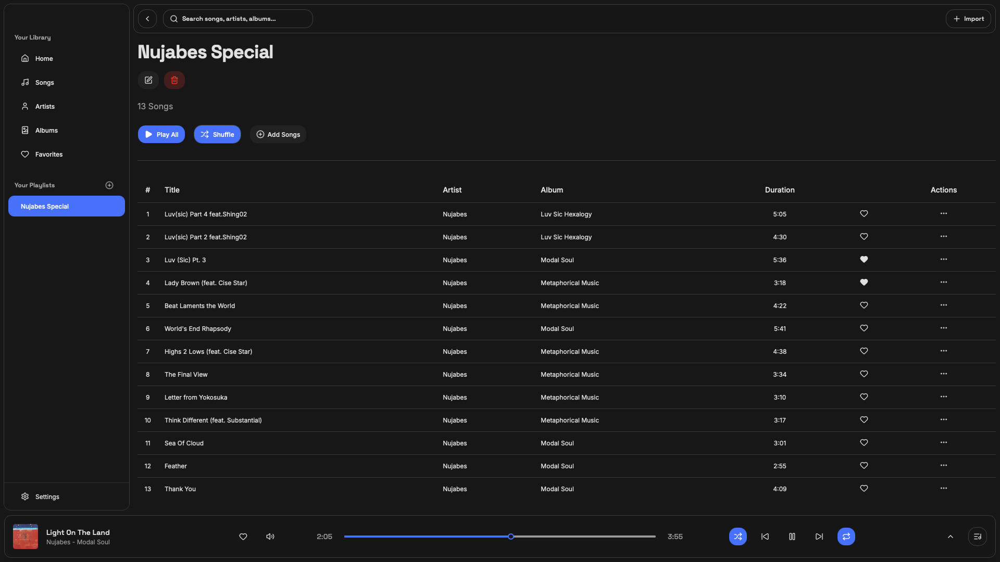
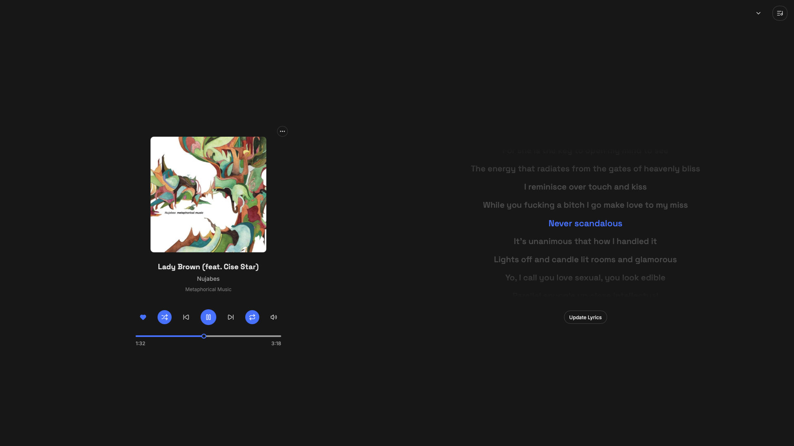
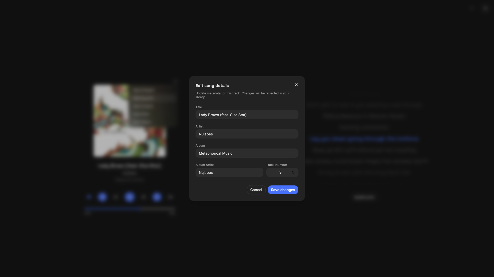

<p align="center">
  
</p>

# 🎵 Sonara Stream

> A sleek, ultra-fast music player and streaming application built with **Rust**, **Tauri 2**, and **React**. Seamlessly unifies an offline local music library with zero-disk online streaming, sub-500ms playback latency, synced lyrics, and cross-platform desktop (Windows) and mobile (Android) support.

<p align="center">
  <a href="https://github.com/rayyanbobs-art/sonara-stream/releases/latest">
    
  </a>
  <a href="https://github.com/rayyanbobs-art/sonara-stream/blob/main/LICENSE">
    
  </a>
  <a href="https://github.com/rayyanbobs-art/sonara-stream/stargazers">
    
  </a>
  <a href="https://github.com/rayyanbobs-art/sonara-stream/releases">
    
  </a>
</p>

---

## ✨ Features

### 🎧 Dual-Engine Playback: Offline Library + Online Streaming
- **⚡ Zero-Disk In-Memory Streaming**: Instant audio streaming directly buffered in RAM — no audio files are downloaded or saved to your disk.
- **📁 Local Music Library (SQLite)**: Lightning-fast scanning of local music folders, extracting ID3/metadata into an embedded SQLite database (`sonara.db`) with zero external tracking.
- **✏️ Safe Metadata Editor**: Edit song titles, artists, and album information directly inside the app without destructively modifying source files.
- **🚀 Sub-Second Playback Latency**: Predictive pre-fetching, progressive stream acceleration, and thread-safe deduplication slash streaming playback start times to **< 500ms**.

### 🎶 Smart Music Discovery & Playback
- **📝 Real-Time Synced Lyrics (LRCLIB)**: Synced (`.lrc` timestamped format) karaoke scrolling and plain text lyrics powered by LRCLIB, cached locally on disk for 7 days.
- **📻 YouTube Music-Style Genre Autoplay**: Automatically detects the musical genre and era of the currently playing song and curates a continuous **Radio Mix** of iconic similar tracks.
- **📑 "Up Next" Queue Drawer**: Slide-out panel displaying upcoming mix tracks with album artwork, live animated visualizer equalizer, and one-click track jumping.
- **🔄 Anti-Loop Protection**: Intelligent session history tracking and queue preservation prevents repetitive 2-song loops and duplicate covers/remixes.
- **🔍 Real-Time Autocomplete Search**: Sub-25ms search suggestions with full keyboard and touch navigation (`↑`/`↓` and `Enter`).
- **🎧 Spotify Link Resolution**: Paste Spotify track URLs (`open.spotify.com/track/...`) to automatically resolve title, artist, and album artwork via Spotify oEmbed, then match and stream high-quality audio from YouTube (*note: audio is always streamed from YouTube, not from Spotify servers*).

### 📱 Native Android Support
- **🎵 Background Audio Playback**: Native Java/Kotlin `MediaPlaybackService` with CPU wake locks (`PARTIAL_WAKE_LOCK`) and Wi-Fi performance locks (`WIFI_MODE_FULL_HIGH_PERF`) so audio streams uninterrupted when the screen is locked.
- **📱 Spotify-Style Lockscreen Controls**: Full Android `MediaSessionCompat` integration with native notification controls (play, pause, next, previous, track title, artist, cover art).
- **🛡️ Pure-Rust Mozilla TLS**: Bundles `webpki-root-certs` directly into the binary, completely bypassing Android's dynamic `rustls-platform-verifier` JNI classloader to eliminate mobile search crashes.
- **🔲 Immersive Fullscreen HUD**: Edge-to-edge UI with Android `WindowInsetsCompat.Type.systemBars()` support, preventing status bar/navigation bar overlap on search and HUD controls.

### 🎨 Design & Desktop Integration
- **✨ Modern Glassmorphic Sonara UI**: Built with React 19, Tailwind CSS v4, Radix UI primitives, and Lucide icons.
- **🎛️ Windows Media Session Integration**: Full support for keyboard hardware media keys (`Play/Pause`, `Next`, `Previous`) and Windows system volume overlay.
- **🪶 Featherweight Footprint**: Native compiled Rust backend (~5 MB binary) using only ~35 MB of RAM (unlike heavy Electron apps consuming 400 MB+).

---

## 📸 Preview & Screenshots

### 🎧 Library & Songs
Browse your local music collection and online trending tracks with instant playback and rich metadata.

<p align="center">
  
</p>

<p align="center">
  
</p>

### 👤 Artists & 💿 Albums
Group songs by artist and album with automatic artwork caching and clean navigation.

<p align="center">
  
</p>

<p align="center">
  
</p>

### ⭐ Playlists & 🎵 Synced Lyrics
Manage custom queues and follow along with real-time synchronized karaoke lyrics.

<p align="center">
  
</p>

<p align="center">
  
</p>

### ✏️ Metadata Editor
Safely customize track details stored directly in your local SQLite database.

<p align="center">
  
</p>

---

## 📥 Downloads

Get the latest release (**v0.6.2**) from [GitHub Releases](https://github.com/rayyanbobs-art/sonara-stream/releases/latest):

| Platform | Installer / Package | Description |
|---|---|---|
| **Windows (Setup)** | [`Sonara.Stream_0.6.2_x64-setup.exe`](https://github.com/rayyanbobs-art/sonara-stream/releases/download/v0.6.2/Sonara.Stream_0.6.2_x64-setup.exe) | 1-click Windows installer with Desktop & Start Menu shortcuts. |
| **Windows (MSI)** | [`Sonara.Stream_0.6.2_x64_en-US.msi`](https://github.com/rayyanbobs-art/sonara-stream/releases/download/v0.6.2/Sonara.Stream_0.6.2_x64_en-US.msi) | Windows Installer package suitable for managed enterprise/silent deployment. |
| **Android (APK)** | [`SonaraStream-Android.apk`](https://github.com/rayyanbobs-art/sonara-stream/releases/download/v0.6.2/SonaraStream-Android.apk) | Universal Android APK with background playback and lockscreen controls. |

### Installation Notes

<details>
<summary><strong>Windows Installation (SmartScreen Notice)</strong></summary>

1. Download `Sonara.Stream_0.6.2_x64-setup.exe` or the `.msi` package.
2. Run the installer.
3. Windows Defender SmartScreen may show an unrecognized app prompt on first run because the binary is built with open-source keys. Click **More info → Run anyway** to proceed.

</details>

<details>
<summary><strong>Android Installation</strong></summary>

1. Download `SonaraStream-Android.apk` directly on your Android phone or tablet.
2. Tap the downloaded APK to install.
3. If prompted by Android, enable **Install from unknown sources** or **Allow from this source** in settings.
4. Open **Sonara Stream** and enjoy background audio playback.

</details>

---

## 📋 Latest Updates

See the full [CHANGELOG.md](./CHANGELOG.md) for detailed version history.

### Highlights:
- **v0.6.2 (Mobile Stability & TLS)**: Bundled Mozilla root certificates via `webpki-roots` to eliminate Android `rustls-platform-verifier` JNI class crashes during searches; hardened SQLite paths and added mobile panic logging.
- **v0.6.1 (Android HUD & Immersive Mode)**: Implemented Android window insets handling (`systemBars`) to prevent notification bar overlap; integrated InnerTube search fallback for mobile.
- **v0.6.0 (Sonara UI Migration)**: Unified Sonara's sleek UI (TanStack Router, Tailwind CSS v4, Radix UI) with Sonara Stream's in-memory playback, SQLite local library, and Android build target.
- **v0.3.1 (Performance)**: Playback decoupling, list virtualization (`@tanstack/react-virtual`), zero-flash startup, and disk-persisted search cache.
- **v0.2.0 (Self-Updating Architecture)**: Automatic `yt-dlp` runtime updater with SHA-256 validation, Tauri desktop updater with minisign verification, and Dependabot automation.

---

## ⚠️ Known Limitations & Architecture Notes

- **yt-dlp & InnerTube Engine**: Desktop stream extraction utilizes a managed `yt-dlp` binary, while Android leverages InnerTube with compiled pure-Rust TLS certificates (`webpki-roots`). Streaming from YouTube is subject to YouTube's Terms of Service and applicable laws.
- **Android Capabilities**: Android background audio playback requires `FOREGROUND_SERVICE`, `FOREGROUND_SERVICE_MEDIA_PLAYBACK`, and `WAKE_LOCK` permissions to ensure uninterrupted listening with the screen off.
- **SmartScreen Notice**: Pre-built Windows binaries are signed with open-source minisign keys for in-app updates, but do not possess an expensive EV certificate. Windows SmartScreen may present a one-time prompt on first install.
- **Local-First Privacy**: Library information, playlists, favorites, and playback state are saved strictly on your local device (SQLite & browser `localStorage`). No accounts, no cloud sync, no tracking.

---

## 🛠️ Development & Building

### Prerequisites
- [Bun](https://bun.sh/) (v1.2+) & [Node.js](https://nodejs.org/) (v18+)
- [Rust Toolchain](https://rustup.rs/) (`stable-x86_64-pc-windows-msvc` for Windows, plus Android targets for mobile)
- Visual Studio Build Tools (C++ workload)
- Android SDK & NDK (only if developing or building Android APKs)

### Desktop Sidecar Binary Setup (`yt-dlp`)
Tauri desktop expects the sidecar executable to match the target triple (`yt-dlp-x86_64-pc-windows-msvc.exe`). Because binaries are excluded from Git, fetch and verify it before building:

```powershell
# Fetch and verify pinned yt-dlp sidecar binary via PowerShell
powershell -ExecutionPolicy Bypass -File scripts/fetch-ytdlp.ps1
```
*Note: During desktop build, `src-tauri/build.rs` verifies that the binary exists and matches the pinned SHA-256 checksum.*

### Updating yt-dlp

Sonara Stream maintains extraction reliability through complementary update paths:

#### Path 1: Automatic Runtime Self-Updater (For Users)
The desktop application autonomously manages the `yt-dlp` streaming engine at runtime without requiring full app reinstallation:
- **How it works**: On startup (and rate-limited to once every 6 hours), Sonara checks `https://api.github.com/repos/yt-dlp/yt-dlp/releases/latest`.
- **Integrity Verification**: It downloads `yt-dlp.exe` alongside `SHA2-256SUMS` to a temporary directory in app data, hashes the binary, and strictly validates that its SHA-256 matches the release checksum. Any mismatch immediately purges the files without touching active state.
- **Atomic Activation**: On hash verification, the binary is moved into `%APPDATA%/com.sonara.stream/binaries/yt-dlp-{version}.exe` and safely activated once in-flight child processes complete.
- **Automatic Rollback**: If consecutive extraction errors reach 3 on a downloaded binary, Sonara automatically rolls back to the previous stable binary (or falls back to the bundled sidecar) and blacklists the faulty version.
- **User Control**: Automatic updates can be toggled on/off at any time in **Settings**, where users can also trigger a manual "Check for Engine Updates" action.

#### Path 2: Maintainer Pinned Sidecar Bump (For Releases)
When creating new Sonara releases with a fresh bundled sidecar baseline:
1. **Download the new release executable**:
   ```powershell
   Invoke-WebRequest -Uri "https://github.com/yt-dlp/yt-dlp/releases/download/<NEW_TAG>/yt-dlp.exe" -OutFile "src-tauri/binaries/yt-dlp-x86_64-pc-windows-msvc.exe"
   ```
2. **Compute its cryptographic SHA-256 hash**:
   ```powershell
   Get-FileHash -Path "src-tauri/binaries/yt-dlp-x86_64-pc-windows-msvc.exe" -Algorithm SHA256
   ```
3. **Update build and script configurations**:
   - Update `EXPECTED_YTDLP_SHA256` and the version comments in `src-tauri/build.rs`.
   - Update `$YTDLP_VERSION` and `$EXPECTED_SHA256` in `scripts/fetch-ytdlp.ps1`.
4. **Verify integrity and compatibility**:
   - Run `cargo test --manifest-path src-tauri/Cargo.toml`
   - Run `bun run tauri build`

#### Path 3: Desktop Application Updates (Tauri Updater)
Sonara Stream desktop updates are built with `@tauri-apps/plugin-updater` and cryptographically signed with minisign keys:
- **Non-blocking Notification**: On startup (or via manual check in **Settings**), Sonara queries GitHub Releases for `latest.json`. If a newer version is available, a non-intrusive update banner displays release details and download progress.
- **Playback Protection**: An update will never interrupt active audio playback. Users can restart at their convenience or dismiss the notification.
- **Signer Key Setup (For Maintainers)**:
  1. Generate a Tauri signer private/public keypair:
     ```bash
     bun run tauri signer generate -w ~/.tauri/sonara.key
     ```
  2. Set the generated public key in `src-tauri/tauri.conf.json`:
     ```json
     "plugins": {
       "updater": {
         "pubkey": "<MINISIGN_PUBLIC_KEY>"
       }
     }
     ```
  3. Store the private key and password in repository GitHub Secrets:
     - `TAURI_SIGNING_PRIVATE_KEY`: Content of `~/.tauri/sonara.key`
     - `TAURI_SIGNING_PRIVATE_KEY_PASSWORD`: Password supplied during key creation

#### Path 4: Repository Dependency Maintenance (Dependabot)
- Automated weekly pull requests scan and update `npm` (`package.json`) and `cargo` (`src-tauri/Cargo.toml`) dependencies.
- Minor and patch updates are grouped into consolidated PRs to minimize noise, while major version upgrades receive individual pull requests.
- Every PR automatically executes the full CI test suite defined in `.github/workflows/ci.yml`.

---

### Setup & Run Commands

#### Desktop (Windows)
```bash
# Clone the repository
git clone https://github.com/rayyanbobs-art/sonara-stream.git
cd sonara-stream

# Fetch sidecar binary
powershell -ExecutionPolicy Bypass -File scripts/fetch-ytdlp.ps1

# Install dependencies
bun install

# Run in development mode (hot reload)
bun run tauri dev

# Build optimized production release (.exe & .msi)
bun run tauri build
```

#### Mobile (Android)
```bash
# Initialize Android targets (first-time only)
bun run tauri android init

# Run on connected Android device / emulator
bun run tauri android dev

# Build production Android APK
bun run tauri android build --apk
```

### Running Tests
```bash
# Run frontend type and unit checks
bun run test

# Run offline Rust backend unit tests
cargo test --manifest-path src-tauri/Cargo.toml

# Run network/binary-dependent tests
cargo test --manifest-path src-tauri/Cargo.toml -- --ignored
```

---

## 🌐 Network Requests This App Makes

Sonara Stream runs locally on your device and collects no telemetry, analytics, or user identifiers. The app interacts only with the following external endpoints:

| Destination | Initiator | Purpose | Data Leaving Your Device |
|---|---|---|---|
| **YouTube** (`*.googlevideo.com`, `*.ytimg.com`) | Backend (`yt-dlp` / InnerTube) & Webview `<audio>` / `` | Searching songs, extracting direct audio stream URLs, streaming audio playback, and displaying track thumbnails. | Search keywords entered in the search bar, YouTube video IDs for stream resolution, and standard HTTP streaming range headers. |
| **`suggestqueries.google.com`** | Frontend Webview (`fetch`) | Providing real-time autocomplete search suggestions as you type in the search bar. | Typed query strings directly sent from the search input field. |
| **`itunes.apple.com`** (`*.mzstatic.com`) | Rust backend (`reqwest`) & Webview `` | Identifying song genre and fetching diverse auto-mix recommendations; loading album artwork. | URL-encoded track title, artist name, and detected genre keyword; thumbnail image requests sent to Apple CDN (`*.mzstatic.com`). |
| **Spotify** (`open.spotify.com/oembed`, `*.scdn.co`, `*.spotifycdn.com`) | Rust backend (`reqwest`) & Webview `` | Resolving track title, artist name, and cover artwork when a Spotify link is pasted. | The public Spotify track URL pasted by the user sent to Spotify's oEmbed endpoint; artwork image requests sent to Spotify CDN. |
| **GitHub Releases (`yt-dlp`)** (`api.github.com`, `objects.githubusercontent.com`) | Rust backend (`reqwest`) | Checking for latest `yt-dlp` updates, downloading release checksums (`SHA2-256SUMS`), and fetching verified binary updates (Desktop only). | Standard HTTPS GET requests for release assets and version tags; no personal or user data sent. |
| **GitHub Releases (Sonara App)** (`github.com/rayyanbobs-art/sonara-stream`) | Rust backend (`tauri-plugin-updater`) | Checking for newer application releases (`latest.json`), downloading signed installer updates. | Standard HTTPS GET requests for version manifest and update bundles; no telemetry sent. |
| **LRCLIB** (`lrclib.net`) | Rust backend (`reqwest`) | Fetching synchronized (.lrc format with timestamps) and plain text lyrics for currently playing songs; cached locally on disk for 7 days. | URL-encoded track title, artist name, and duration; no telemetry or personal identifiers sent. |

---

## 📜 License
[MIT License](./LICENSE). Copyright (c) 2026 rayyanbobs-art.
