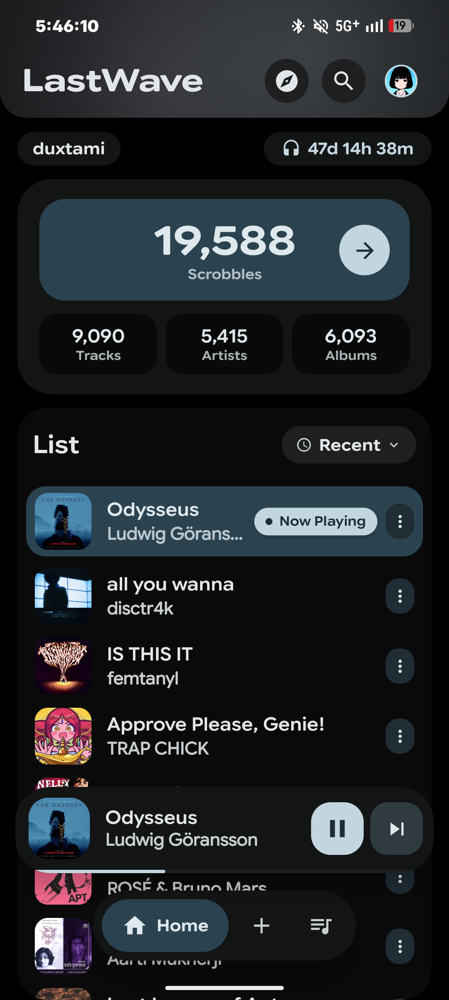

<div align="center">

# Sonara Stream

**High-Resolution Lossless Music Streaming & Player with Real-Time Synced Lyrics & Smart Discovery for Android, built with Material 3 Expressive design.**

*Based on and cloned from the open-source [LastWave-Native](https://github.com/Clash-Projects/LastWave-Native) project by Duxtami & Ajisth ([Clash-Projects](https://github.com/Clash-Projects)), licensed under GNU General Public License v3.0.*

<p align="center">
  <a href="https://github.com/duxtami/LastWave-native/stargazers">
    
  </a>
  <a href="https://github.com/duxtami/LastWave-native/network/members">
    
  </a>
  <a href="#">
    
  </a>
  <a href="#">
    
  </a>
  <a href="#">
    
  </a>
</p>

<p align="center">
  <a href="https://t.me/clashprojects">
    
  </a>
  <a href="https://t.me/MaterialYouApp">
    
  </a>
</p>

</div>

<br/>

<div align="center">
  
  
  
  <br/>
  <br/>
  
  
  
</div>

<br/>

##  Overview

**LastWave** is a native Android music streaming app engineered for audiophiles and music lovers. It delivers studio-quality **Hi-Res Lossless FLAC (up to 24-bit/192kHz)** and Opus playback, offline downloads with full embedded metadata, kinetic real-time synchronized lyrics, smart algorithmic playlist generation, and automatic scrobbling across all your devices.

Designed from the ground up around **Material 3 Expressive**, LastWave pairs an ultra-smooth visual experience with uncompromising audio fidelity.

---

##  Lossless Audio Streaming & Backend

LastWave features a lossless streaming and download engine powered directly by the **[clashflac](https://github.com/ajisth69/clashflac)** backend:

-  **Studio Master Quality:** Stream and download bit-perfect FLAC audio up to **24-bit / 192kHz** directly via **[clashflac](https://github.com/ajisth69/clashflac)**.
-  **Opus & High-Efficiency Audio:** Seamless dual-engine fallback streaming via YouTube Music Opus for exhaustive global catalog coverage.
-  **Full-Fidelity Offline Downloads:** One-tap downloads saved directly to your local storage (`Music/LastWave`), fully tagged with high-res cover art, release tags, and synchronized LRCLIB `.lrc` lyrics.
-  **Zero-Gap Playback:** Powered by AndroidX Media3 ExoPlayer with foreground audio playback and lockscreen media session controls.

---

##  Key Features

| Icon | Feature | Highlight |
|:---:|:---|:---|
|  | **Lossless Streaming** | True Hi-Res 24-bit FLAC & Opus streaming with lossless bitstream output. |
|  | **Offline Downloader** | Download albums, mixes, and individual songs with embedded album art and synced lyrics. |
|  | **Real-Time Synced Lyrics** | Millisecond-accurate animated karaoke lyrics powered by LRCLIB with 8 customizable physics motion styles (Apple Fluid, Karaoke Pulse, Kinetic Slide, etc.). |
|  | **Smart Discovery Engine** | Tailored recommendation feed built from your taste profile, similar seeds, loved tracks, and live charts. |
|  | **Genre DNA & Explorer** | Dynamic breakdown of your favorite genres with instant "Start Mix" and one-tap "Discover More" recommendations. |
|  | **Taste Mixes & Playlists** | Generate unique 30–35 track mood mixes, regenerate fresh variations, manage custom playlists, and sync with YouTube Music. |
|  | **Friends & Social Feed** | Browse friends' listening habits, explore their top tracks, and play their taste profiles. |
|  | **Integrated Scrobbler** | Automatic background scrobbler watching your active media sessions across any Android music app with zero battery drain. |
|  | **Material 3 Expressive** | Dynamic wallpaper colors, custom HSL color picker, dynamic album art palette, fluid morphing cards, and tactile haptics. |

---

##  Tech Stack & Architecture

- **Language & Framework:** 100% Kotlin + Jetpack Compose (Material 3 Expressive)
- **Lossless Audio Backend:** **[clashflac](https://github.com/ajisth69/clashflac)** by [Ajisth (ajisth69)](https://github.com/ajisth69)
- **Audio Engine:** AndroidX Media3 ExoPlayer + MediaSessionService
- **Lyrics Engine:** [LRCLIB](https://lrclib.net) API
- **Data & Intelligence:** Last.fm API, Room DB, Jetpack DataStore, Dagger Hilt

---

##  Getting Started

1. Download the latest APK from the **[Releases](https://github.com/duxtami/LastWave-native/actions)** tab.
2. Install the single release package (`LastWave-v4.0.0-release.apk`).
3. Connect your Last.fm account to sync your scrobbles, taste profile, and discovery feed.
4. Start streaming in bit-perfect lossless quality.

---

##  Building from Source

```bash
git clone https://github.com/duxtami/LastWave-native.git
cd LastWave-native
./gradlew assembleRelease
```

---

##  Community & Support

-  **Updates & Support:** [Join @clashprojects on Telegram](https://t.me/clashprojects)
-  **More From Us:** [Join @MaterialYouApp on Telegram](https://t.me/MaterialYouApp)

---

<div align="center">
  <p><b>LastWave</b> is built by <a href="https://github.com/duxtami">Duxtami</a> & <a href="https://github.com/ajisth69">Ajisth</a>.</p>
</div>
[](https://gitgem.org/github/Clash-Projects/LastWave-Native)
